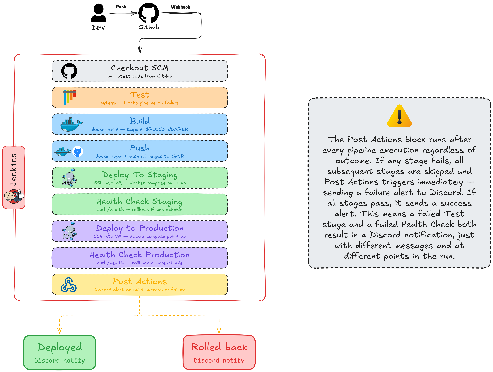
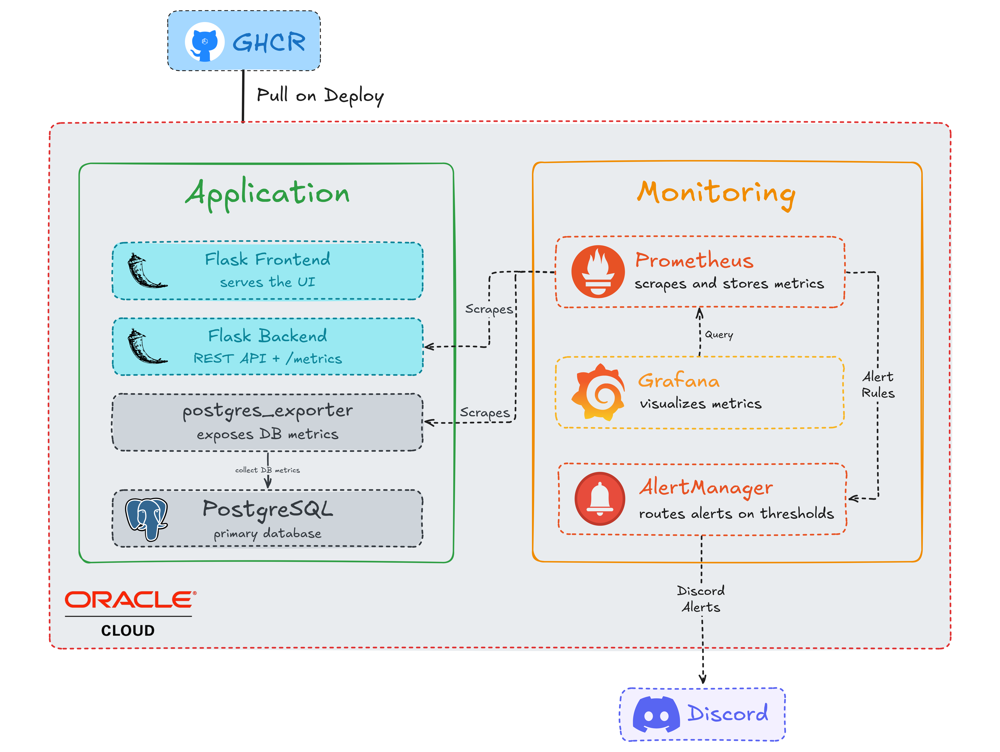
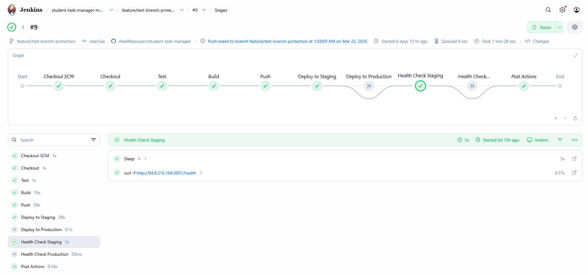
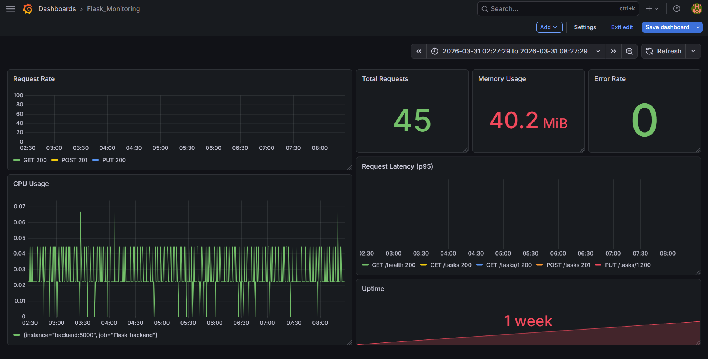

# Student Task Manager — CI/CD Pipeline

---

## Overview

**Student Task Manager** is a containerized microservices application built around a fully automated CI/CD pipeline. The project demonstrates how modern engineering teams ship code reliably — any push to GitHub automatically triggers testing, builds fresh Docker images, deploys to a live server, verifies the deployment, and rolls back if something goes wrong. All without manual intervention.

Built with Jenkins, Docker, and hosted on Oracle Cloud, the pipeline covers the full delivery lifecycle across two independent environments — staging and production — with real-time observability through Prometheus and Grafana.

---

## Features

| Category | What it does |
|---|---|
| **Pipeline Trigger** | GitHub webhook fires on every push |
| **Quality Gate** | pytest must pass or deployment is blocked |
| **Image Management** | Docker images built, tagged by build number, pushed to GHCR |
| **Environments** | Independent staging and production pipelines |
| **Health Verification** | Post-deploy health check before marking build successful |
| **Resilience** | Automatic rollback to previous image on health check failure |
| **Notifications** | Discord alerts on every build success or failure |
| **Access Control** | Branch protection on `main` — PRs only, CI must pass |
| **Monitoring** | Prometheus scrapes Flask and PostgreSQL metrics in real time |
| **Alerting** | Alertmanager sends Discord alerts on service degradation |

---

## Tech Stack

| Layer | Technology |
|---|---|
| **Application** | Python, Flask, PostgreSQL |
| **Testing** | pytest |
| **Containerization** | Docker, Docker Compose |
| **CI/CD** | Jenkins, GitHub Webhooks, GHCR |
| **Monitoring** | Prometheus, Grafana, Alertmanager |
| **Infrastructure** | Oracle Cloud Free Tier (Ubuntu VM) |
| **Notifications** | Discord Webhooks |
| **Source Control** | GitHub |

---

## Architecture

### CI/CD Pipeline Flow

> The Post Actions block runs after every pipeline execution regardless of outcome. If any stage fails, all subsequent stages are skipped and Post Actions triggers immediately — sending a failure alert to Discord. If all stages pass, it sends a success alert. This means a failed Test stage and a failed Health Check both result in a Discord notification, just with different messages and at different points in the run.

### Infrastructure & Monitoring

### Pipeline in Action

### Grafana Dashboards

**Flask Backend Metrics**

**PostgreSQL Metrics**

---

## Getting Started

### Prerequisites

- Oracle Cloud account (Free Tier) with an Ubuntu VM provisioned
- Docker 28.2.2 and Docker Compose v2.24.0 installed on the VM
- Java 17 installed on the VM
- Jenkins 2.541.2 self-hosted on the VM
- A GitHub account with a Personal Access Token (scopes: `repo`, `write:packages`)
- A Discord server with two webhooks — one for Jenkins notifications, one for Alertmanager alerts

### Setup

1. **Clone the repository** and fill in `.env` with your environment variables — database credentials, image names, and network prefix

2. **Configure Jenkins** — add the following credentials to the Jenkins store: GitHub token, GHCR token, SSH key for the VM, and Discord webhook URL

3. **Connect GitHub to Jenkins** — create a webhook on your repository pointing to `http://YOUR_VM_IP:8080/github-webhook/`

4. **Create a multibranch pipeline** in Jenkins pointing to your repository — Jenkins will automatically detect the Jenkinsfile

5. **Trigger the pipeline** by pushing to a feature branch and opening a pull request — verify all stages pass before merging to `main`

6. **Start the monitoring stack** by running `docker compose -f docker-compose.monitoring.yml up -d` on the VM — Grafana is available at port 3000

---

*ENSAM Meknès — CS Student DevOps Project*